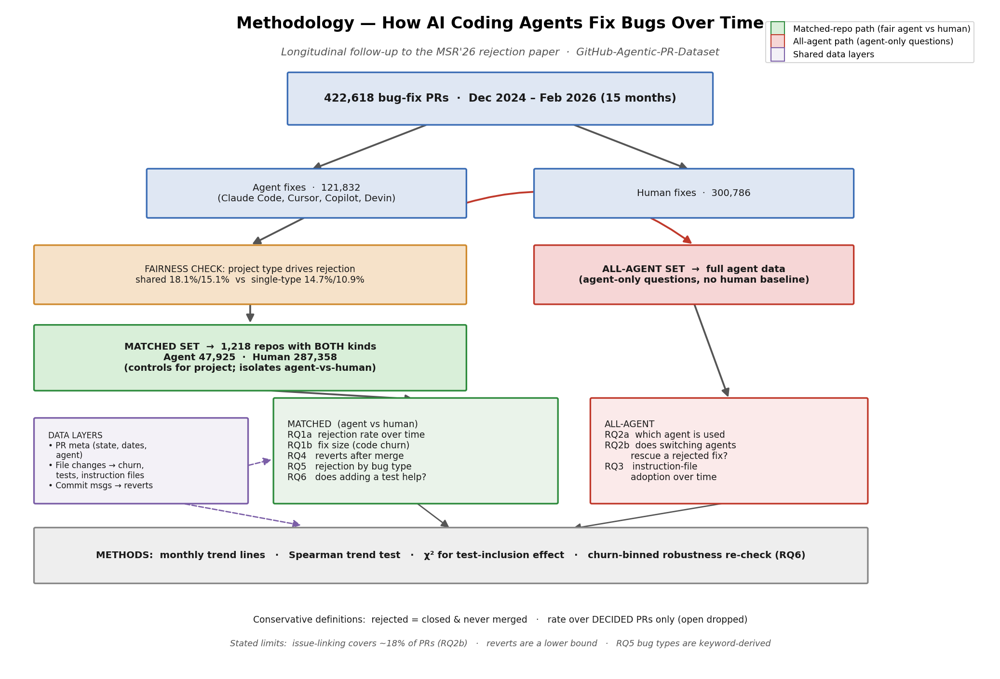

# How AI Coding Agents Fix Bugs Over Time — Approach

**Follow-up to our MSR'26 paper** *"Understanding the Rejection of Fixes Generated by Agentic
Pull Requests."* The paper studied a single snapshot of why AI-agent pull-request (PR) fixes get
rejected; here we add a **time axis** and broaden the study to eight research questions over a
15-month window.

**Data.** 422,618 bug-fix PRs (Dec 2024 – Feb 2026) from the GitHub-Agentic-PR-Dataset:
121,832 written by AI agents (Claude Code, Cursor, Copilot, Devin) and 300,786 by humans.

---

## Figure 1 — Study design

*Figure 1. One dataset is split into agent and human fixes. A fairness check shows that the
**project type**, not just authorship, drives rejection, which motivates a **matched-repo
design**: every agent-vs-human question is answered only inside the 1,218 repositories that
contain both kinds of fixes. Agent-only questions use the full agent data. Three shared data
layers (PR metadata, file changes, commit messages) feed the eight research questions.*

---

## Approach

**1. Conservative, explicit outcome definitions.** A PR is *rejected* only if it was closed
**and** never merged. The *rejection rate* is computed over **decided** PRs (merged or closed)
only — still-open PRs are excluded so unknown outcomes cannot bias the rate.

**2. Matched-repo design (the central idea).** Agents and humans do not work on the same
projects, so a naive comparison confounds *who wrote the fix* with *which project it lives in*.
We first confirm this matters: in repos containing both kinds of fixes the rejection rates are
18.1% (agent) / 15.1% (human), whereas in single-type repos they fall to 14.7% / 10.9%. We
therefore restrict every agent-vs-human question to the **1,218 repositories that contain both**
(agent n = 47,925, human n = 287,358), so any difference reflects agent vs human rather than the
project. Agent-only questions use the full agent data.

**3. Three data layers.** PR metadata (state, dates, author), file-level changes (deriving fix
size, test files, and instruction files via regex), and commit messages (revert detection).

**4. Eight research questions.**

| RQ | Question | Set |
|----|----------|-----|
| RQ1a | Does the rejection rate change over time? | matched |
| RQ1b | Do fixes get bigger or smaller over time? | matched |
| RQ4  | Once merged, do fixes get undone (reverted)? | matched |
| RQ5  | Which bug types are agents good/bad at? | matched |
| RQ6  | Does adding a test make a fix more likely to be accepted? | matched |
| RQ2a | Do people switch which agent they use? | all agents |
| RQ2b | When an agent fix is rejected, does switching agents rescue it? | all agents |
| RQ3  | Are developers adding agent instruction files over time? | all agents |

**5. Preprocessing (summary).** Derive month from the creation date and drop undated PRs; build
the merged/rejected flags (treating empty / `"NaT"` / `"None"` timestamps as *not merged*);
compute per-PR code churn from added + removed lines (PRs with no file rows are excluded from
size results, not counted as zero); flag test and instruction files by regex; link fixes to the
issues they close (`fix/close/resolve #N`) for RQ2b; and detect reverts via `reverts commit <sha>`
in commit messages. Full details are in `METHODOLOGY.md`.

**6. Validation.** Trends are tested with Spearman correlation; the test-inclusion effect (RQ6)
with a χ² test, then re-checked **within churn bins** to confirm the effect is not merely a
side-effect of fix size.

---

## Limitations

- Agent vs human is compared only inside the 1,218 shared repos (by design).
- RQ2b sees only the ~18% of fixes that explicitly reference an issue.
- Revert counts are a **lower bound** (only PR-routed reverts are visible).
- RQ5 bug types are keyword-derived and should be spot-checked before publishing.
- The overall ~16% rejection rate is not directly comparable to the paper's earlier snapshot —
  it reflects a much larger, more recent re-collection.
